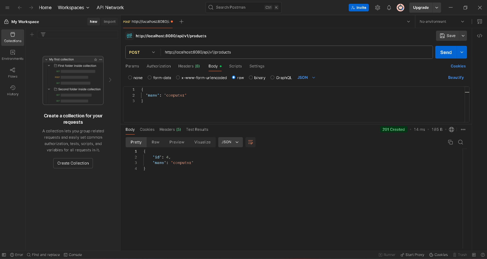
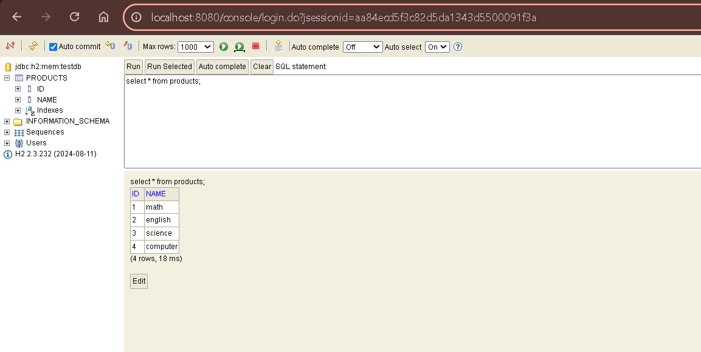
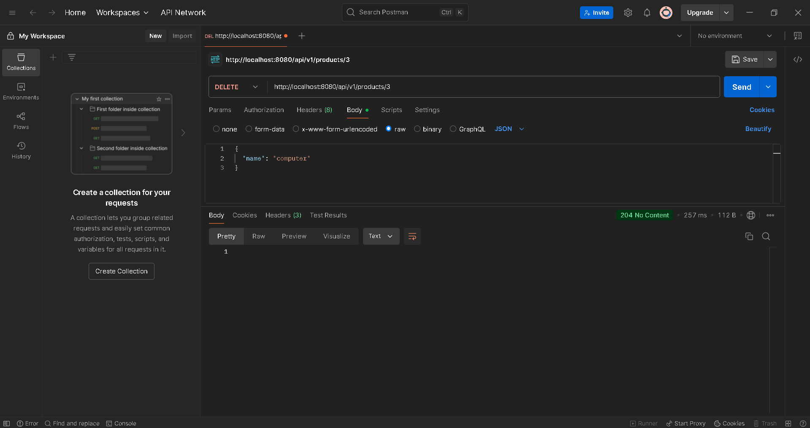
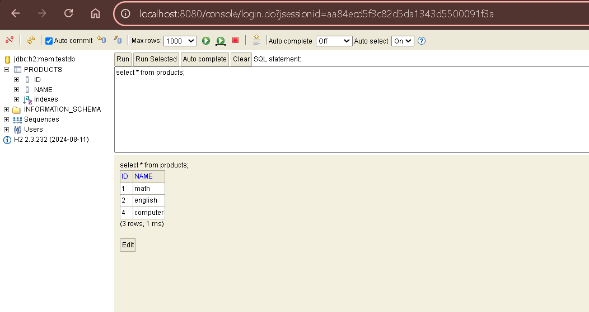
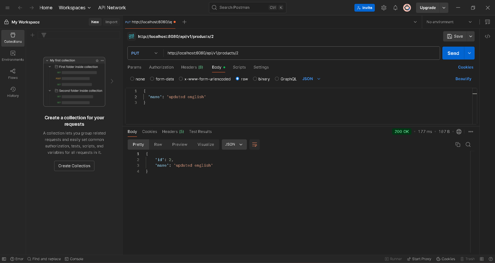
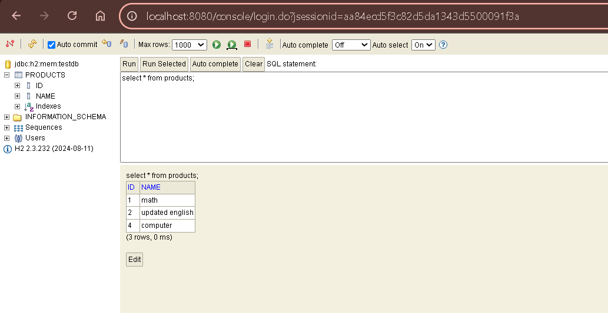

FirstRestAPI Project

Overview
This project is a simple REST API built with Java and Spring Boot. It allows you to manage products by creating, reading, updating, and deleting them.

Tools Used
- Java and Spring Boot for building the API.
- H2 Database: a lightweight, in-memory database used for storing product data during development and testing.
- Postman: main tool for testing the API endpoints.
- Swagger: sometimes used to explore and test the API.

What Was Done
- Created API endpoints to:
  - Add a new product (POST)
  - Get a product by its ID (GET)
  - Update product details (PUT)
  - Delete a product by ID (DELETE)
- Configured H2 database to store products temporarily while the app runs.
- Tested each endpoint using Postman to ensure they work as expected.
- Used the H2 database console to verify data was correctly added, updated, or removed.
- Occasionally used Swagger to visualize and test the API.

How to Test
1. Run the Spring Boot application.
2. Use Postman to send HTTP requests to the API:
   - POST to create products
   - GET to retrieve them by ID
   - PUT to update product details
   - DELETE to remove products
3. Open the H2 console (at http://localhost:8080/console) to run SQL queries and check the database state.
4. Observe results of operations through the console and Postman responses.

Screenshots
Screenshots show:

Slides 62 Q&A
Even though ProductRepository is empty, it extends JpaRepository, which already has methods like save, findById, findAll, and deleteById. Spring Boot automatically provides the implementation at runtime, so we can use these methods in our service without writing any code ourselves.

*Created Afreen*
